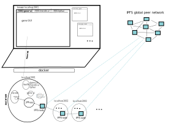
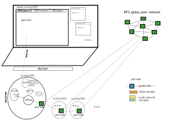
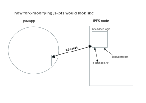
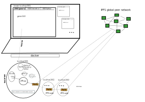
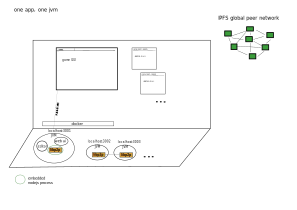
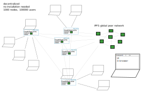

Continuation of:

- [../cloud-native-system/design.md](../cloud-native-system/design.md)
- [../search-for-the-game.md](../search-for-the-game.md)
- [../origin-cluster/origin-cluster.md](../origin-cluster/origin-cluster.md)
- [../as-vscode-extension.md](../deathstar.ltee/as-vscode-extension.md)
- [../deathstar.ltee/design-notes.md](../deathstar.ltee/design-notes.md)
- [../play-scenarios-in-browser/design-notes.md](../play-scenarios-in-browser/design-notes.md)

## deathstar design

</img>

- app is some form of desktop instance with an IPFS node included
- IPFS node provides networking and idenetity
- through IPFS node we discover other peers, connect to host peers and bidirectionally exchange data
- the UI runs either in browser or in a webrenderer of a desktop app - so web ui in every case
- docker-to-desktop-app exists?  "take this docker compose deploymen and turn into installable updatable app" ?
  - if exists, app can have browser GUI over rsocket (it's just a renderer)
- app has a jvm-app that is always non-binary so that eval works - this app hosts games
- updates : app or deployment should be installable and auto-updatable
- app comes with: IPFS node, jvm-app, ui
- delivery with docker app: build, share, and run a set of microservices as a single entity
  - users will need to install docker, and docker app plugin
  - then, with a single command install an app (or another instance of it) `docker app install myuser/hello-world:0.1.0 --set hello.port=8181`
  - app ui will notify user about updates and show two commands: one to run a new version of an app, and another (after) to uninstall the previous

## stage 1

- add 
  - traefik (serves ui, proxies rsocket to app directly, serves IPFS node ui)
  - ui-prod ui-dev (dev only builds, ui-prod always serves)
  - jvm-app (has rsocket and can talk to ui)
  - IPFS node (just runs on it's own at this point and we can access it's ui via traefik)
- make this one instance launchable: we launch everything, then jvm-app manually
- make several named instances launchable, such that we only toggle jvm-app 

## stage 2

- explore IPFS node

## one way to develop system and scenarios

- developer or not - there should be a unified single way to develop sceanrios
- and naturally, we developers want to develop them within the system (so we start the whole thing and we can delop it and/or scenarios)
- so what we do it build Death Star game, the same process should be exposed to any user if they want to develop their scenarios (choose only how many player instances to launch in docker)
- but, it should be so that they can use their own repositories - or, simply be able once done to take files and put them themselves wherever
- and the system can download sceanrios from any git repo
- so one system, one way to build it and scenarios within it, so anybody is a user/palyer/developer

## with one system, should browser vscode be in its own tab and game gui in its own?

- if so, VSCode will have a minimal extension for it that will carry out ops originating from jvm-app
- jvm-app and vscode may even share a filesystem inside a docker volume
- jvm-app will say to extension "open this and that file for the user" or say "show timer" or may ask "give me that file" (if they don't share fs, otherwise jvm-app will read itlsef, which is preferable)
- users can download files they edit with browser vscode within the system
- and game GUI will be a standalone app communicating with jvm-app to show scenario's graphics and multiplayer etc.

</img>

- IPFS nodes are *both* connected to global peer network and local docker network so that the system can be run even offline
  - IPFS node adds a locally resolvable docker network address to the list of default (auto generated by node addresses)
  - even if laptop is offline or elsewise, nodes still discover each other and multiplayer works


## OS windows for seeing the editor and game gui simulteneously?

- open game gui tab in the brower tab in a new browser window taking half-screen (rigth side)
- open editor tab in another browser window taking the left side of the scree
- drag middle boudary to make one or another bigger
- why
  - if we build our game ui and editor as part of it, we dicard all existing tooling and we'll need to make an editor,clj extension, repl
  - can we leverage the fact that editors exist and build on that? e.g. by using vscode-in-the-browser
  - from user experience standpoint: it is almost the same as having our own tabs and windows inside our ui, whereas OS level windows do exactly that
  - another: links and decoupling from single-ui/single tool
  - although ui runs on localhost, links like `game/player/stats/?whatever=3` should be exchangable ideally, like it already works on the web
  - in the game, such link can be part of a another app's ui and will eventually result in a global decentralzied query (or local for starters) and any peer will see the resulting page, so links would work
- if we use browser tabs themselves as tabs, we can rely on link and think in terms of apps
- it's a different way to look at it: we don't build a single ui, but rather a docker system with possible several uis (we already have IPFS ui, game ui)
- in simpler words
  - players will edit code -> that will go to jvm-app -> and it will push state to game gui
  - so although we use two browser windows by means of splitting PC's screen, we input into the same app entity

## source code of the system (DeathStarGame repo) shared between containers? 

- VScode container and jvm-app preferably should share a filesystem, so that only jvm-app did all fs writes
- another thing - when the system runs, ideally, it should be possible to REPL into it using its own VScode browser ui, and for that the source code should come with the system
- another case - when traefik, IPFS , ui-prod ... etc. containers will be lauchned, they will need to access the config files (which are usually COPYd into on image build or passed as docker-compose env variables)
- but what if it was possible to give all caontainers access to a volume of sorts, that would contain the source - github.com/DeathStarGame/DeathStarGame - a central singular instance of all source
- than, every container could access it's config from this root directory (via volume) , and there would be no need to COPY it in every Dockerfile
- can the dev/prod separation be avoided and can the system come as an OS of sorts?
- this way, the ui build container (with shadow-cljs) could output files as is into respective out dirs within DeathStarGame repo tree, and ui-prod could serve that path directly, no need for copying
- another approach: single container with scripts to start/stop binaries (can even consider a scripting alternative to bash as with a container it's a trivial apt install)

## running the system inside a single container

- first of all, it works (no docker-compose files, restart:always and container tools, but scripts instead)
- it works with giving repo as a volume to several containers( ok that build will override files ,.user dirs will be shared),apps will point to the same src code, so restarting apps ok
- needed an alternative to bash - a lisp, preferably clojure - so that all scripts (even in f files when docking containers) were in a sane language
- with one container, we lose cloud tools and have to script, but gain a bit more flexibility(programmability) and a sort of simplicity/singularity
- bash alternative: only if it has *interoperability* with bash, such that we translate bash examples in docs back and forth without guessing

## distinct builder and runner docker-compose services(containers)

- one builder will run shadow-cljs that will compile both ui and vscode extension
- another will build uberjar which will be run from a slimmer jre-only container in release version (if ran without REPLs into system itself)
- all services will share a volume (DeathStarGame repo), builders will output to usual target/out dirs and runners will run from them

## what installing a scenario looks like?

- sidenote: scenario process, running on the server, should control it's own render (even if it's embedded into game gui), so system only talks to one scneario process
- can installing a scenario mean spinning up a container?
- can scenario gui run in a separate tab? 
- can scenario server-side be a nodejs app? a jvm-app?
- so can scanerios be built as apps interacting with DeathStarGame apis
- if scenario is installed as a regular dep, deos it mean (require-ing) it in jvm builder and adding a :build target and compiling renderer in shadow-cljs builder?

## ~~yes, scenarios should be apps, spinned up in containers~~

- <s>we are already in docker
- sceanrio creaters should be elevated to building real apps
- when relying on apis, scenario dependencies and ideas stay even more free, with the feeling of building an appliaction, not jsut scripting, so the quality of scenarios will rise exponentially as more people will be willing and excited to really go for it with scenarios
- users should build apps that use DeathStarGame api or are used by it
- communicate bidirectionally over rsocket
- system and scenraios talk using data, each having its own runtime (system has several), giving natuaral isolation
- calrity and ease of development: we launch the system and then start/stop scneario app only, whereas system is always running as a whole and exposes only apis
- scnearios being apps of their own provide isolation, definitiveness of api, dependency freedom, decoupling of system and scnearios
- scenarios become true extensions, addons, or microservices to the system
- users creating scenraios build literally apps of their own, while system focuses on api communication over how-do-we-intergate-these-scripts (although we have docker and containers)
- should be possible to develop such scenario apps using the system itself
  - browser vscode would open a directory with such app's code (copied from a template directory from DeathStarGame repo)
  - system's shadow-cljs builder would add a build target and compile the app, expose nrepl, system would connect vscode to nrepl and spin up a container with this new scenario
  - now we have a repl into an app and see scenario's gui inside a tab (iframe)
  - we have a button that restarts the app container if needed (or posisbly even use VSCode's terminal into apps container, so user can restart themselves)
  - one we done, we can copy the code from the system on PC and put into a repo or smth</s>


## ~~sceanrio ui as iframe inside game ui~~

- <s>from user experience, we need to see player's scenario views and a combined view, meaning being able to switch between multiple small tabs (or open them alongide each other) inside single browser tab
- if scencario gui is an app, openable even in a standlone tab, it should be used by the as iframe</s>

</img>


## installing scenarios: as namespaces

- sceanrios are simply code
- are developable only within the system, which is as it should be
- installing would mean 
  - copying files from a url into the app entity's filesystem
  - jvm app would compile(or even eval them) thus creating scenario's namespace
  - option A: ui builder would adds a new build target and compiles an app, which is used by iframe
  - option B: renderer code is directly sent by jvm-app to game-ui and evaled there

## scenario as a library: game forms the state on jvm and delivers to game-ui, which passes it to scenario renderers

- simulations run on jvm and new state is formed for that game in it's unique generated namespace
- and game passes it over its connection to game-ui and subsequently to sceanrio renderer
- as opposed to scenario updating its own renderers over unique connection
- why: game may choose to render that scenario multiple times and it should be in charge of that
- if so, than every such renderer cannot have a whole connection back to scenario app (otherwise there will be a connection for each tab rendering state of a particular player)
- or tabs for dev and latest game state for the player themselves
- point is: game should be free to render state multiple times and in a selective manner

## single container vs docker-compose: docker-compose

- since docker containers don't use much RAM and shared volume is a norm, docker-compose is a better tool and abstraction, than lower level bash scripting
- the size of the app installation (all images) does not matter, and on updates new layers will be downloaded faster

## step one: app entity contains just IPFS node and jvm-app, do data flow between peers

- this is the heart of the system


## installation/launch container

- no need for OS scripts, instead use a conatiner like a scrip ( with --rm flag , will exit after app is run)
- the container may need to be run as privileged (to be able to isntall docker app plugin), or not even, if with stack
- user runs this container, which in tern either installs docker app or uses docker stack to run the system
- it's a more powerful (we can use a ligit app inside, cljs nodejs for example, or even jvm) not just bash scripts
- user experience: just run one thing and game is up, run it again with --uninstall and it's down, run it again with --remove-volumes and that's done as well etc.


## player app eneities: identifying by port, localhost:PORT = docker-compose --project-name PORT

- so app's api/ui port also acts as an app name (or name prefix), to avoid ambiguity
- possible to encapsulate app under port ?

## installation/launch container part 2

- a privileged container that has api and can dynamically change files in sorce volume, so apps can be configured to comply to that one port
- a launch container is users/developers interface to the system: we basically put bash scripts and maybe programm api in there and can start/stop/configure system
- but: it's cross platform and versatile (a running program, not just script)
- it would also install docker app plugin or enable swarm

## how technically code evalution will work in the system

- [ palyers still need a REPL , but game state should be advancable, recreatable, syncable and independent of ui](https://github.com/sergeiudris/deathstar.lab/blob/4412eebce46dfad0f860276a2aa8d9c0e69c53c2/docs/deathstar.ltee/as-vscode-extension.md#state-its-about-state)
- [namepsaces, namespaces everywhere: namespaces can be discarded and re-created](https://github.com/sergeiudris/deathstar.lab/blob/4412eebce46dfad0f860276a2aa8d9c0e69c53c2/docs/deathstar.ltee/as-vscode-extension.md#how-to-def-namespaces-are-free)
- [discarding/creting copies of palyer's namespace in clojure](https://github.com/sergeiudris/deathstar.lab/blob/4412eebce46dfad0f860276a2aa8d9c0e69c53c2/docs/deathstar.ltee/as-vscode-extension.md#discardingcreting-copies-of-palyers-namespace-in-clojure)
- [simulation as f(state,code,time), why there is no need for cljs self-hosting](https://github.com/sergeiudris/deathstar.lab/blob/4412eebce46dfad0f860276a2aa8d9c0e69c53c2/docs/deathstar.ltee/as-vscode-extension.md#simulation-as-fstatecodetime-why-there-is-no-need-for-cljs-self-hosting)
- correction
  - code will be evaled on one mahcine - the host peer of that particular game : connected peers will send all the inputs and get eval results back
  - game simulations are run on the host peer as well (both main and test)
  - else the same: peers will get their unique namespace and copies of it, it's about creating/discarding namespaces, updating individual states (for rendering player's map) and running simultaions to advance the source of truth state of the game

## ipfs nodes, router loopback, docker compose network

- ipfs nodes (or any other apps) sometimes cannot connect due to router not supporting loopback (cannot dial your own WAN public ip)
- one approach would be to use some public ipfs node(s) that support pubsub and communicate through them, but this is fragile
- instead, make nodes able to discover/connect through docker-compose network, while keeping global ipfs node netwroking intact (by adding additional addresses to ~/.ipfs/config Addresses/Swarm
- this way, nodes can communicate locally, even offline, but would be able to connect to the game launched on another peer 

## peer conmmunication: connecting to peer vs pubsub grid - pubsub grid

- IPFS are working on making pubsub group-like: as in, peers would not particiapte in only global pubsub, but be able to join a certain group
- and they are making it more and more efficient by designing/applying new algorithms
- so looking forward, it means, that the peers of the game app would be able to form global sub-pubsub (even now it's possible with gloval pubsub)
- and would be able to exhcange data through it, as a single global app entity
- a peer would only need to connect to one other game peer and they are part of the app, can receive data
- that in principle allows us to think about data exchange (joining game, observing) as streams of data over pubsub, rather than direct connections of player peers to host peer
- however, for efficiency and speed and reducing network load, it could be better to play games peers-to-host, while doing queries and data sync over pubsub: so pubsub for everything, but a particular game via connecting
- or: a game could be a sub-sub-pubsub, so that observers can subscribe to that particular game
- with that in mind
  - when developing locally, instead of connecting to peer, go for autodiscover through mDNS (whatever that is) and forming a pubsub (global for now)

## in dev mode: be able to switch between circuit relay mode and local docker network with auto discovery

- it is awesome that communication over circuit relay just works out of the box
- but still, from design standpoint - elegance, sanity, it's peer-to-peer after all - locally launched nodes should auto discover and connect, even offline

## ipfs pubsib grid with rsocket protocol

- once peers are connected somehow, pubsub works
- what is needed is an rsocket abstraction over IPFS pubsub: be able to make p2p requests, bidirectional
  - behind the scenes, give messages id etc.

## ipfs: docker network autodiscovery, pubsub do work out-of-the-box 

- docker network autodiscovery,pubsub works out-of-the-box when on a single deafult network - nodes find each other, connect and pubsub - all just works
- docker networks probably need to be configured a bit more to allow named network auto discovery as well


## IPFS global pubsub allows for global game/player discovery staight away: it's like a radio, where app topic (and each game/event) is a frequency

- every peer will sub to the game topic: which should be like a frequency/channel
- every peer will have it's own db to store data from hosted games
- but peer's db will also store *global* lists : current players online, current games created
- when a peer creates a game, event will go into pubsub and every peer's db will update the list
- when a peer (or connected/sharing pubsub for the game peers) will query - they query one single db on the host peer's machine

## IPFS node pubsub stream cannot be consumed from jvm-app: either use libp2p or fork-modify js-ipfs node

- sadly, IPFS node's pubsub stream cannot be consumed from another app via node's API anyway...
- so basically it means either using libp2p inside an app or forking node and modifying it to expose pubsub stream via an API
- jvm-libp2p?
- the app logic should ideally be decoupled from peer logic: when we restart app, we shouldn't drop connections or lose id
- in that sense, we need a node, but such that it allows us to consume and send pubsub 
- there are also things that IPFS node stores in files (peer id, settings) that we'd have to re-implement, although the goal is access to pubsub

</img>

## how fork-modifying js-ipfs would look like

</img>

- this agent should be written as sorf of a plugin, that compiles into a dependency and forked js-ipfs launches it in one place somewhere (and gives all the runtime refs as args)
- this way fork can move along with js-ipfs, getting updates from upstream

## ~~peer process should be part of jvm-app: evolve into better development flow (away from restarting the jvm), less moving parts, and app will deal with filesystem already~~

</img>

- <s>we want to use libp2p to build around peers and pubsub, and we don't need IPFS node
- both libp2p and IPFS node have a lot of features that are not part of the game, so should not focus on those, let others handle them ok
- when app is working, it will be naturall to have a peer logic running a process of jvm-app
- the only reason - bad reason - to do it over rsocket as a standalone container is misconception about easier development flow: it's clear how to restart docker container, that's why it is tempting to build processes as docker containers (although in this case it's unnecessary)
- instead improve jvm development flow: design such that processes can be restarted, or simply avoid running frequently (rather build-build-build-run)
- but eventually - the sooner the better - there need to be a way to restart logical async processes without restarting jvm
- jvm will will have
  - libp2p peer process
  - an rsocket connection to ui
  - (possibly) rsocket to vscode editor
  - db connection
  - filesystem access
- and it is great to build those as processes, but be able to handle main async flow around these abstractions inside a single runtime with core.async
- so by design of the peer, libp2p peer process should be part of the jvm-app</s>

## ~~one app, one jvm: game is the focus, not development~~

</img>

- <s>app is a single jvm process, a peer node
- editor should be part of the game, start simpliest and evolve overtime
- db should be embedded into jvm 
- we have to deal with filesystem anyway, so no problem in doing so from jvm
- so many moving parts go away: editor-to-jvm communication, unnecessary gui containers, traefik
- app should be distributed as installable desktop app 
- jvm and REPL is the perfect environment for development, should be the focus
- app can serve gui two ways
  - via embedded http server into browser (from resources directory)
  - via javafx
- if javafx, have to deal with javafx, but have simplier setup: only need one repl (probably)
- if browser, no need for javafx, but have to do rsocket and http server and a cljs repl
- gui app dev tool can even come with the app if needed (should not be, game is the focus)
- editing scenarios first will be through external editor, but oovertime the ingame editor will evolve and be sane enough
- the issue with config files in develpment: how to start multiple instances
  - either launch the app with config file argument
  - or select config after load from directory
  - or use db for that and kind of "login" into that player's profile via db 
- random ports and mDNS: use libp2p's random ports feature so that app instances can find each other naturally</s>

## ~~use browser gui instead of javafx: one app with gui in browser on localhost:port~~

</img>

- <s>javafx brings unnecessary complexity to ui, which is needed to be web page anyway
- http server and GUI on port brings simplicity to development: can have a docker-compose with peer0 peer1 peer2 ... services, each having volume to .peer1 .peer2 .peer3
- a seprate GUI dev container will be used for building ui, but files will be output directly into jvm /resources folder
- http-server will run right on jvm and simply serve static files
- each peer container will expose one port for gui (and for REPL during develpment)
- jvm-app running inside container **can be easily run as uberjar on any system**
- it's a single app that has a renderer in browser on localhost:port</s>

## ~~libp2p as embedded nodejs process into jvm~~

</img>

- <s>js libp2p is actively developed and used
- instead of running libp2p-jvm, which is yet unclear, better to run a nodejs process inside jvm that does libp2p peer logic
- there should be simple interprocess communication, so that we can start/stop the node process, or ask/send data from jvm/repl</s>


- wrong, wrong: cannot have an uberjar and a nodejs app running in it, unless it's graalvm
- even if it is, it's a trick
- why? because **node_modules** and **native_dependencies** - those cannot be part of `some-script.js`, so **`npm i` is unavoidable by design** 
- so we cannot rely on things like `libp2p-tcp` nad `libp2p-mdns` to be includable into a `script.js` - they may have native deps (and likely do, cause they trigger node-gyp)
- *so if we want to use js-libp2p, it can only be run with `node app.js`, not from jvm`

## on how to restart IPFS node container from within docker deployment: use docker-compose's restart:on-failure property 

- send shutdown singnal to deamon (from main container via http api) /v0/shutdown
- the container will stop, but docker will restart it because of restart:always or restart:on failure feature
- if containers can be stopped and restarted like this (for example to apply IPFS config changes), no need for single docker container, can go docker-compose deployment

## docker-compose and fork-moifying ipfs node

- docker-compose as outlined above
- ipfs node, because it has features, js - because we can use cljs 


## acquiring rsocket channel (or stream) on each ipfs pubsub sub topic

- app will use peernode's api to sub to a topic via request-stream
- each topic subscription can have it's own rsoket stream on a seprate channel (if it makes sense, maybe not, maybe all vals on same ops| channel)
- but if we use, it's powerful: each game can be cleanly represented by one rsocket stream
- again, it's an option: maybe we'll use :game/uuid anyway


## system operations should be explict in specifying request-response request-stream fire-and-forget request-channel

- explitely, as part of github.cljctools/csp
- the idea of values(ops) in the system are decoupled from operation how is false: it makes system and ops ambiguos, unclear and decision-less
- ops should explicetly say: "this is a stream request and here are responses for it", "this is a request-response request and here's response"
- so an op specifies
  - op-key : op's name
  - op-type: request-response request-stream request-channel fire-and-forget
  - val-type: request or response
- when we request an rsocket channel, we proabably cannot do (and shouldn't,by design) request-responses within it (it's likely not rsocket inside rsocket)
- so in code, after request-channel, we'll get :send and :recv channels, and all values - in and out:
  - are fire-n-forget: neither response nor requests
  - or initiator's values are :requests and acceptor's are :responses (if in app these are two different values, but same :op-key and a distinction is needed)
- fire-and-forget: we should explicitely specify or if value has no key it's fire-and-forget
- request-response: we specify :request-reponse and - :request or :response
- request-stream : the intial value has :val-type :request, the streamed values can be either :response or not specified

## cljctools/csp probalby should not have rsocket op types

- we have channels, core.async channels
- request-stream means "take this (chan) and establish a stream over rsocket, so that this (chan) receives values"
- it does not and should not specify which values
- so basically, it always bi-drectional request/response or fire-nad-forget, but with an incredible ability to acquire streams and channels
- for example, app will request-stream from peernode, get a channel and all pubsub messages will be conveyed onto this channel, but in code - it's just a channel, and values are unaware (well, it's not a problem to have unused value keys, it's just that cljctools/csp probalby should not have rsocket op types)
- request stream means one channel
- request cahnnel means two channels (:send and :recv)
- fire-and-forget means use the default channel
- reqeust-response measn use the default channel
- nah, even simpler
  - request-response is a special request-stream of one value
  - request-stream is get a stream of many values
  - fire-and-forget is a psecial stream of one value 
  - request-channel is two stream of values

## would not it be better to explicitely say 'these are responses to request-stream operation'?

- say, `cljscootls/csp` specifies `request` `response` `fire-n-forget` `request-stream` `request-channel` and also no specifier 
- if some process asks another `(some-proc.chan/some-data-please-as-stream`) - that particular opeation specifies `request-stream`, but all the stream values are the same operation (name) but with no op-type
- so rsocket op-types are used for requests, and reponses (unless it request response) are values with no op-type
- and {:op-key some-op :op-type :request-stream} is one operation, but {:op-key some-op} is a different
- so the question is: would not it be better to explicitely say "these are responses to request-stream operation"?

## why full op-type op-orient op-key spec can matter: piping into ine channel and distinguishing

- a process can pass for example an ops| channel to request-stream, and all stream values are then put on ops|
- so ops| needs to explicitely condp on "hey, this is the case of :some-op :request-stream :response" 
- but isn't it a bad design? shouldn't we isntead use (alts!) and multiple channels?

## simple: there is no contradiciton, qualifying an op is a choice

- cljstools/csp has the spec for all ops
- an we explicitely request-stream etc.
- but the values on that stream channel are apps decision: can be fully qualified can be unqualified: because it's an op defined for app's proc, and we can define it either as fully qualified op or as unqualified op and directly put those onto a channel
- in regards to choice: fully qualified seem better and more explicit


## first and most important feature? being able to add own scenarios from day 1

- make it so that peers can add their own scenario files, even by changing existing ones
- so the game is open and unlimited in scenarios from day one
- else next
- so first
  - a list of scenarios, can install/uninstall by repo:hash/path  
  - can host a game and play with other

## game is like a an upstream repo and forks

- a host runs sceanrio generation
- creates files locally and sends to data to peers, they also create generated game files
- we open with code-server code in the browser and eval in our own dev namespace
- other peer's evals are intercepted (from single local nrepl) and sent to others, re-evaled for each player
- so it's a sychronization of namespaces by broadcasting eval ops
- losing eval ops does not matter: a host peer runs the game's main process and timer, and on time asks other to submit the whole namespace
- it get's evaled once (like a program) and it's main or other scenario defined functions are rused in a simulation that runs on the host - and the state is broadcasted as we go
- or better: the current state and code is sent to everyone and everyone runs the simulation, so it's fast
- so things run locally actually, and we sync state over pubsub, and **one peer** is - by trust - the source of truth
- a game is like a an upstream repo and forks: every peer has the full version and state of the game, if upstream goes away, another player becomes the host
- the winner is decided by the state of the host (upstream)
- creating a game is creating a pubsub topic
- every peer's has namespaces of other peers, which are synced over pubsub
- simulations are run on each peer, and winner is decided by each peer, after the game is complete peers echange the list of [peer game-results] and one peer is marked as host, so by trust their game-results are true 

## game flow from creation to completion

- peer creates a game: generates a unique uuid, subs and publishes to it as topic (frequency)
- the uuid is either shared with other peers by pegeon or owl, or there is a galobally synced list of games
- first, for invite only game, the game topic (frequency) should be shared with invitees
- peers emit regular ping on the frequency to signal that they are in the game, every peers sees the list
- ok, host peer - which at this point is simply bu trust and convention - runs the scenario generation, creates files and sends to others, they create game files on disk as well
- peers create namespaces game-id.peer-id
- host peer starts the scenario process (timer), publishes game start, other peers receive and start the timeer as well
- peers can eval in their namespace, that changes state (atom),each atom is synced to local browser ui (can see tabs for each peer)
- first scenario - rover on mars: there is a map (tiles) and we want to program rover (write a function or two) to score better on that map
- peers eval locally to try to score, reset and try again, all via REPL
- by the end of the timer, we need to save the file with functions that we think will score best
- all that - happens on every peer and we can see each peer's map and rover moving when they eval and their score
- so rover scneario - is single player, who scores most
- timer is up, repl is paused, each peer's namespaces is sent to others, evaled and each player runs all player's simulations and get's a list of scores
- peers exchange the list of scores, the winner is the highest score on the host peer's list

## encourage scenario creation in conrtibutor's repos, like deathstar.lab/scenarios

- scenarios coming with the game is a list of such deps (repos) with scenarios
- when game launches, it creates a docker volume and installes scenarios there (deps cli puts cache into /root/.clojure )
- also the gui is compiled and put into volumes
- or put it into ctx volume
- the jvm-app has the volume available and can read fs and show in ui which scenarios are installed
- compiler comes with the game: on every game launch it goes over the default list of scenarios and added by user and deps-installs and shadow-compiles missing/new ones
- so evan default scenarios should be a list of repo:hash/path, like deps, and are installed on first launch
- the same mechanism for new scenarios

## installing a scenario as a user: open a installed scnearios deps.edn and add entry, press install

- user can have an extended list of scenarios, installed scenarios list cannot have multiple version for one sceanrio
- so it should be 
```clojure
; https://clojure.org/reference/deps_and_cli#_dependencies
{github.username.deathstar.lab.scenarios/rovers {:git/url "https://github.com/username/deathstar.lab"
                                                 :sha "988b8191c6b31ece0cfcef6d15111efda999f262"
                                                 :deps/root "./scenarios/rovers" }}
```

## users manually adding scenarios by modifying deps.edn and source files to import namespaces?

- ui's deps.edn points to deps.edn with scenarios' UIs
- app's deps.edn points to deps.edn with sceanrio itself
- user can open and change both files using code-server - add more scenarios
- the ui watches the files, so it automatically installes the scenario and recompiles ui
- but: if namespace is not required, it won't get added into bundle...
- but: if peers open an actual .cljs file that imports scanerios namespaces, than it's in
- so scenario installation is actually changing the source code of the game? 
- same way a scenario can be added to app itself (to namespace listing scenarios)


## we create the game first (pubsub frequency, room), then host picks the scenario (or vote)

- peers join the game
- then host selects the scenario
- it the same thing as scenario first, but in terms of game page design: we first click generic "create game" button, means frequency, than page opens, and we configure the game

## heart beats, waves: peers send state as a heartbeat, can use timeout to make decision - elect a new host for example

- host creates the game and emits state periodically and on a request (when a peer joins)
- peers get state/upadates and reset/merge
- if say, 5-10 seconds pass without any event from host, game shows: "elect new host" - or simply, use timestamp, the first joined player is the new host


## peer's nREPL - all about state: eval only locally and emit state only

- if we intercept nREPL ops and send those, first is more complex, second it would mean a peer could eval System/exit on all other peer
- if we send peer's state only, it by design cannot have conflicts/sieffects, it's just data and is used for rendering
- if so, nrepl client is not needed, peer can use lein provided nREPL, which already works
- how it happens
  - every peer evals in their namespace locally, that changes state and it is pushed to ui and emitted to other peers
  - recieved state is also pushed to ui for rendering
- submitting code
  - submitting means reading the file from filesystem and sending it
  - which means eval.. bummer ...
  - well, either a context of sorts or spec-validate code on macroexpand
- well, yes
  - we send state only on regular evals
  - but on submission, file is read/sent and every peer evals all files from other peers and runs the simulation

## need isolated execution environemnt for player's code evaluation

- should be easily creatable/discardable
- should be completely isonalted,like a web page
- btw, webpage would be ideal
- so we could create a single environment, the sceanrio runs in it and emits/receives state/events over a channel - game runs in it (a version for each player)
- then, on submission every player's code is run in each environment, each completes, gives back results - this is peer's version of game results (as described above)

## player code eval: headless chrome, puppeteer and self-hosted clojurescript

- game has a precompiled ui app with self-hosted clojurescipt (that page can eval)
- scenario is a code that we don't install but rather read files and eval them inside scenario's page
- a service container will run puppeteer to give access to headless chromium and create pages/listen to events and even eval in pages
- for each sceanrio execution enviroment, we create a page (it always load same sceanrio app from say "ui:9500/sceanrio.html")
- then we give it (it's unclear yet how with puppeteer) scenario cljs code, page evals sceanrio namespaces (so they must come in order of dep tree, from leafs to main)
- now page in puppeteer has scenario app runnning - both core and ui - so all the rendering deps work
- jvm app (or nodejs, because of puppeteer?) talks to scenario's page which runs the game and on complete gives scores/results back
- FAIL: how will user see ui? we'll have to render same thing in the browser as well jsut for rendering


## what if actual browser page is game eval environment?

- first example: vscode editor and extension that understands channels instead of connections
  - imagine page can both eval and exposes nrepl operations api
  - imagine extension does not connect via host:port, but rather asks for a core.async channel
  - this way, extension puts vals onto channel and via editor-tab message exchange values git into page's nrepl-like process and evals
  - dcoupling: this way, exntension's design is decoupled from "how" connection is established: socket, msg exahge or pegeon - it only uses channels (so transports)
  - decoouple sockets and stuff into transports that expose core.async channel
  - back to this example: this way, an editor can "open" REPL directly into page (values are simply piped)
  - this way (alas, sadly, vscode does not run js in non-active tabs, but if it could) it would be possible to REPL into pages, recreate at will, and keep state by sending it from pages to host process
- second example: in the browser
  - all is the same, but the host is page, and tabs are iframes
  - each iframe loads a base sceanrio page, evals scenario code, exposes nrepl over a channel
  - an actual browser page has an editor running (virtual files or smth, or real), but that editor REPLs into iframes - again, buy simply implementing a smg exahge transport by take! put! on channels

## execution environments are so much better than namespaces

- simple, recreatable, non-colliding, literally - isolated
- and web page is unique - it not only has best ui tools, it's most lightweight execution environment
- browser pages should be where scenario is played - be it browser itlsef, editor tab(electron) or puppeteer

## iframes as execution evironment

- some iframes are used for peer's eval, others to render state from other peers
- how are they different from puppeteer ? we can see the rendering, simple as that
- with puppeteer, we'd have to run scenario in a headless page and then run the exact same page in iframe and sync state
- when using iframes though the multiplayer looks like this
  - peers do peer logic inside docker
  - state is both kept on jvm-app and sent to iframes (each peer has one or more) and rendered
  - while with player's evals it reverse: evals and sceanrio run in the iframe(s) and state is sent to jvm-app and other peers
  - so browser is where the scenario runs, entirely, with self-hosted cljs, so that scenario file can literally be evaled inside and iframe
  - same with game simulations on time: they also run  in iframes, and if peer closes the iframe - well, their results will be missing or noted as incomplete
  - and iframe or app - no difference: *closing the page is the same as turning pc off or shutting the app down*
  - and since the game is like upstream and forks, everyone's game results will be submitted, and players by trust decide(select) which are true 

## ~~browser pages as execution environment: need to actually do what browser does with tabs~~

- <s>iframes are limited in terms of processes (not necesserily a thread pool, not necesserily a process)
- app shoud actually run a browser itself  - like electoron does - and open literal browser tabs(pages) but layout out cusomly as antd tabs of sorts
- so it's puppeteer, but pages do actaully render
- electron has Browser, which is `<webview>` tag - but is it limited as VScode's weview?</s>

## ~~rsocket-page-transport~~

- <s>implement a trasnport to use rsocket protocol into the page</s>

## ~~it's desktop, it's pages~~

- <s>browser page is our execution environment
- so iframes is not that
- we need a desktop browser-like app
- *can electron BrowserViews be used inside VScode?</s>

## scenario runtime: iframes, code-editor, shadow-cljs

- we use actual code-server
- we compile sceanrios with shadow-cljs or similar/modified abstraction
- we connect nREPL to the build server, but implemented it so that we can switch between not just builds, but runtimes
- we render the compiled scenario in iframes (in some we evaluate, others render state comming from peers)
- scenario is an app that itself loads DeathStarGame/src/scenario-runtime-api and starts it - it communicates with the game
- the game can perform ops in sceario according to this api: sceanrio implements the api, for example - ::scenario.chan/reset-state which allows to render other peer's states

## scenario and player runtimes should be separate 

- sceanrio runs in one page, player evals and via chan api updates state of scenario
- if player is in the same runtime with sceanrio state, we can manipulate state outside of api
- if we communicate over channel, then only api defined operations and specced values will pass
- actually, scenario **can be three programs** (each runs in its own browser page)
  - renderer (runs in iframe and only renders state and collects inputs)
  - scenario core (runs simulations and commicates with renderer and player programs)
  - player program
- they all communicate over channels
- and that solves the issue of "how do we make sure player does not use this and that in their function.."
  - as a scenario program will make specced requests to palyer program
  - and if response is invalid, or - *it takes say longer than 50msec* - player programs answer is marked as missed
- when it's an interactive scenario - scenario program asks multiple player programs - such timeouts will ensure that simulation runs and player programs cannot interfere/brak it, as communication is timeout-based and protocoled (chan api) and values are speeced
- and for that, puppeteer is needed somehow

## what do peers write? programs; how do we submit programs? we send compiled no-deps main.js files

- dependecy resolution, compilation and repl work locally
- but multiplayer simulations - when a scenario program talks to multiple player programs during simulation - must run on a single machine
- so we need to submit somthing
- if it's code, we're in trouble with evalution (Self-hoted heavy pages) dep resolution, dealing with multi-file program etc.
- but what is needed? we need to run each players program together with scenario program , where whey talk over channels, and get the simultaion result
- if we eficiently compile - into main.js, which is only player's code and shared.js, which is scenario's deps, we can send over network only that main.js file
- when programs arrive to peer, we directly put them into puppeteer pages (injecting shared.js that is already present locally) and run, piping values through channels
- so players excahnge data (state) and small no-dependecy main.js files containing just the compiled .cljs namespaces of player's program

## installing and building sceanrios: we should always have few named builds and switch "pointer" (path) to scenario

- so we run one build container as we do now - scenario-list
- and we change the deps.edn file to point (it will itself download and do everything) to a different scenario
- so at a time, when we select a scenario, it's whe only one we can repl into - and it should be so by design
- now, consider even this
  - sceanrios have the same namespaces - e.g. deathstar.sceanrio.sceanrio.main deathstar.sceanrio.player.main ..
  - since we are swithing build tool to compile a certain scenario, if namesapces are the same, we don't need to change shadow-cljs.edn
- so from app, we programmatically re-write the deps.edn on the filesystem when scenario is chosen
- shadow-cljs should somehow react to with a rebuild (all deps are the same)
- we literally switch app(sceanrio) logic, while the system remains unhindered
- and we can have a list of sceanrios easlily contain entries for the same scenario but different hashes

## use 2 programs instead of 3: scenario and player

- scenario program by default is a renderer - has an op that resets state
- other ops init/run simpulations/generate etc.
- so if scenario is run in puppeteer, it's renderer is exactly the same app, but we only perform one op on it - render state
- long story short: render is not an app, but an op of a scenario app


## a few simple scenarios and multiplayer first, then enrich scenarios

- the first most important feature -  being able to add own scenarios from day 1 (see section prior)
- now we've introduced rover sceanrio and there is a choice: focus on making it rich and complex or build the multiplayer
- it's much more thrilling and exciting  - and focus and output is much higher - when we can build the scenario and play it right away, rather than have an unworking system and a complex scenario that can only be screecasted
- we need simple but robust system - and we can do that because unlike eveeryone else we can handle asynchrony and we have most powerful out-of-this world features at our disposal in one runtimelss language
- instead of building our own super-scenario right away, we need to make the system work with a few simple scenarios, and together (starting from the same point) with others build richer sceanrios for the system
- so it's multiplayer first, peers and pubsub, ability to find other players automatically , ability to play and install scenarios; then we elevate scenarios to awesome


## ~~programmatic approach to system processes: we need to handle starts/stops/removes and all other linux operations from within a cljc program~~

- <s>here is the starting point: we need to start/stop scenario compiler (shadow-cljs) from within the system, and grom cljc program, not shell (becase asynchrony and sanity)
- if it runs in a separate container, we need to run inside it and agnet porgam and rsocket into it to ... - makes no sense, then we could just run everyhting in one container, and start/stop processes using shell/cp_process
- but if so, it defies the whole purpose of docker compose, and maybe even docker: can we run it on the desktop?
- for dev purposes, it's always in the container of course, and for dependecies either - docker+ container works on any system, and is sane
- but we must and need to start/stop linux processes from a regular async flow from inside our main (app) program: 
  - say, we as a user select a different scenario in the ui, the op comes and we want to have all the logic - restart the builder, do stuff to state etc. - be in this one expression
  - so shadow-cljs, puppeteer (potentailly), ipfs restart - these should be within the async flow of app logic, not bash scripts
- let's even look at development
  - right now, to start things (isolation of peers aside), we need to launch several terminals and manually - manually - do a bunch of commands, whereas they should be an async ::init op of the system
  - we should run one app and everyhting else starts (and we can comment things out as usual) - so programmatic system, not bash scripts - then it's one app
  - and all these subprocesses - they should be vars in the program, that we can stop later or do somehting else
  - so we should have one app, it laucnhes processes and then rsockets are opened
- with that, it looks like a singe docker container</s>

## reimplementing docker-compose abstraction makes no sense

- need to dinf a way to build around containers, compose and rsockets, rahter than shoving everything into a single container
- need to find another way to make it programmatically and async possible to restart a container process (sceanrios compiler)


## DeathStarGame is commited to using programming language as the gameplay

- this is an advantage, and a new type of games
- we should have sceanrios ranging from simple to complex, but using clojure as the gameplay
- we don't need to be "sorry for inconvinience" if someone is "used to things as they were"
- we are creating a brand new type of games and playing, where players write programs - can be chaning a few numbers in a given program, can be creating from scratch a system of processes - both are programs
- so there is no multi-purpose, "platform quality" etc., on the contrary - dedication and magic of clojujre
- DeathStarGame is one game, not a platform, with unlimed scenarios and tournament/events focus comming with the system
- scenarios are limited only by athor's imaginagtion, but they are in union with the game -  implement scenario.chan interface, use programming language as gameplay and can be used in torunaments and matches interchangebly (as they implement needed configurations)
- one game, clojure language, unlimited scenarios, tournament and events in the decentralized peer-to-peer IPFS network (pubsub)


## question: how to avoid copying and typing, design for playing with mind by looking at the map?

- in sports or current esports - players are always in equal positions, bound by what they can do at that moment
- so players, in tennis for example, cannot "copy" or automate, and that's the point of the game - who is better on that day when starting on equal footing
- same in starcraft
- the only advantage players can have is in theor mind, everyhting else needs to be re-exectued every time
- in DeathStarGame, we understand that we want to use programming language as gameplay, as it allows us to express behaviors most freely
- we also want to play by looking and the map and thinking
- so at this moment, we have a question design-wise we haven't thought through yet:
- how to avoid player program becoming bloated and automated with all possible checks and solutions and being copied into the game at the start? how to avoid complete automation? how to retain thinking and programming language yet take the best from other sports and e-sports - equal start and no-copying, playing every game fresh on that day at that moment? 


## scenario duration: time to think + step based simulation

- players have time to think before simulations (e.g. 1 min)
- but simulation is step based: we use timeouts, but player program can respond in varying (within range time, e.g. 50-100ms)
- so what we see on the screen are steps with ~1sec interval, but we think of simulaiton as advacing state in steps, not in time (although it player a role)
- a scenario-api will have an operation, where scenario tells the game the approximate/max duration (for example, if scenario is always between 9-10 mins, it infroms the game it's a 10 min scenario)

## simple scenarios: player sending a list of operations to perform (as data, with parameters): move,scan, shoose-closets etc.

- as a simple scenario, yes
- this is basically sending a list of actions, other peers can observe and reason about it: this player chose scan, move,scan, visit, smeth-else with :x 3, :choose-closest true - etc.
- the problem is, it does not use the lanugage per se, only data - we cannot send predicates etc., as it defies the purpose of player program
- but as a simple scenario - yes
- can we use the language and still use high level ops, observable and reasonable? 
  - we can send predicates and use macro to validate them
  - but still: we have scanrio and player program, and it's unbound, but it is playbale and observable to send a program as a list of operations and arguments
  - each operation is literally an options map to a function that actually computes and changes state inside scenario program

## player programs: developing overtime, players choose whether to reveal programs

- player porgram is lanugage (decisions) and data
- while data only scenarios are cool, they are in the simple category, not the default/normal, as they are misisng lanugage and programs
- however, if players develop a program overtime and copy it into scenario when the game starts, and change the parameters afterwards (like with ops as data sceanrios) - that is awesome (players could share their programs, but forcing such thing would be a violation of sorts, so it shuold be by choice)
- so in theory, players could participate in tornaments without anynone seeing their porgrams, but only the resulting operaions
- this is absoluttely possible, becuase sceanrio asks a question and expects an answer within a timelimt, but how player program came up with that op and parameters is up to the program
- so observers see the list of operations (one added on each step) and can reason about *what* ops player program decided on, but *not how*


## DeathStarGame gameplay: actually, always one - scenario program sends data, player program responds with a list of ops

- so it's players choice
  - either tweak parameters and send 10 operations without using incoming data (computing) - this is playing by looking and thinking, data only
  - or player chooses to use the arguments and compute something and then reply with operation value using computaion results to choose op or specify better vlaues
- as observers, we *always* see resulting operations and can reason about them (e.g. "this player used sequence of ops: move,scan, recharge, move.. with those args" etc.)
- we see ops and values and regardless of whether or not they were specified manually or computed, we can reason about them
- players can develop programs for scenario overtime and perform with those in tournaments, reavealing them or not is up to player
- regardless, we can reason "this player's program tends to take scan as the 3 step and prefers low power/high repair locations" etc.
- scenario is parameterized (send ops step by step, or 5/10/n at once), but it can always be played just data (players choose to compute smth from data or jsut tweak ops in the response list)

## ~~scenario-api should be a seprate program~~

- <s>we need a game loop - a process where every cycle counts as the game step
- this way it is possible on every cycle to remove effects that expire
- for example, after rover scans, its range increases but for the next step only
- so when the next - any - operation comes into the game process it loops and removes effects that expire
- if so, the current approach - where scenario program has a process that both does api ops (render, pause, next-move) and actual scneario game ops - makes the loop have cycles that are not game specific
- of course, we could filter and only change effects for operations that are game specific
- but even so, we are mixing two abstractions: a generic program for game-scenario interaction that implements scenario-api and the sceanrio game process
- so we'll make a scenario-api implementation part of DeathStarGame repo, but - scenarios will themselves require it as the dependency, making other implemnentaions.. (at the same time, what's the point? maybe it's better tfor the game to depend on it) 
- yes, definitely
- so scenario rqeuires that process, creates its channels and own channels and passes as args to the process, which uses mixing, pausing and resuming on channels, and scneario-api also knows about requests and time, and can timeout (interval) before putting to the scenario game channel
- so scenario game process always expects next op instantly, while scenario-api process does intervals and timing
- scneario-api process takes options map, with durations, time-per-step etc.
- scenario-api - obviously - establishes connection to the app</s>
- wrong
  - if sceanrio-api program needs to tell sceanrio process "generate data", which process does that?
  - scenario is a program that implements interface and should have craete game loops on its own
  - this is key: not to craete bad, limiting abstractions, squeezing sceanrios into unneccessary boxes (sceanrio should implement a few ops and be a complete program we talk to asynchonosly)

## peers exhcnaging state: state should be a list of operations (events), not a map

- if we limit state to be a single map only, we exclude the possibility of using db and other derived state
- additionally, we cannot send updates
- ACTUALLY: state can be anything scenario wants it to be, from game perspective its serializable data
- but then, how do we send updates? if only scenario knows the form of state? so it's wrong, state basic format should be operations, and scenarios can derive any form for rendering/game loop

## generating data: if possible, send the seed to all peers, so every peer generates same data

- from a brief search it seems specifying the same seed on even on different machines will should produce same result
- tesk.check  - hwich is key - does have :seed option (even to generate)
- so in theory, we should aim at sending seed only and generating data on every machine
- same with state: we send operations (events) and state is derived/relayed from a list of ops (first being generate op with the seed parameter)

## scenario program always works the same, no 'just render state', because state is derived from events

- once started, scenario program takes game events (ops) and changes state
- state is derived from first event to current, as if we've played the game
- the only option may be not using timeouts, so replay toa certain point is instanteneos
- one of the first events - generate, with seed to recreate generation on every peer (works locally with diffrernt iframes, and by design should everyhwere)
- so we never send state-to-render, rather a sequence of ops to perform, from which the actual sceanrio or peer mirror plays the game
- when peer changes it's local scenario and emits their opetions, every other machine has the same scneario program equally performing ops, both programs are the same, no modes

## no need for peernode, and ipfs node as a container is optional

- orbit-db can use a running ipfs node via ipfs-http-client 
  - https://github.com/orbitdb/orbit-db/tree/24ed7f92884ef999d0dcdde6f0236c5f019f8f92#module-with-ipfs-daemon
- ipfs-http-client makes a post request
  - https://github.com/ipfs/js-ipfs/blob/6b993dbab1f827e5deaa89d07e08e0ad6abb49b4/packages/ipfs-http-client/src/pubsub/subscribe.js
- and recieves back a stream, not a response, a stream of messages (until disconnect)
  - https://github.com/ipfs/js-ipfs/blob/6b993dbab1f827e5deaa89d07e08e0ad6abb49b4/packages/ipfs-http-server/src/api/resources/pubsub.js
- so we can directly pububs to a running daemon with a ready to use api, that acts as if we had a direct access to node
- ipfs team have even created `js-ipfsd-ctl` 
  - https://github.com/ipfs/js-ipfsd-ctl/tree/a886590c61a5f783202ebb4d984080fa2c880d9e
- and ipfs-desktop uses it to spawn daemon
  - https://github.com/ipfs-shipyard/ipfs-desktop/blob/0dc2de7372e8e37093c97442df76b9059fa1d3ca/package.json
- we can spawn both go-ipfs and/or js-ipfs daemon from a node program and have full access to the daemon
- so we can even spawn both the daemon from app-node, and init orbit-db passing it daemon directly
- or we can run daemon in a container, and use ipfs-http-client to pubsub

## orbit-db

- game is an event log, (.log orbitdb game-uuid [*])
- creating game is creating a public eventlog db, which eventually consistent stream of updates peers can subscribe to, out of the box, brilliant
- we see games and peers on main pubsub frequency, joining is orbitdb.open(db-address)
- for complete private games, it should be possible to join a game by adress string (given in a medium outside the game)
- one eventlog should be for game lobby (is there a better word?) and start the game event in it informs peers to create the second eventlog - for the game
- if we pause or stop  - these events come to first log, and peers stop putting to the gamelog
- we don't remove events, but if some arrive after stop, we can  add cancellation (revert) events to log
- blocking a peer means adding them to the personal db of blocked peers and ignoring pubsub events from them

## identity 'would-be-amazing's

- identity db(data) should be stored on all peers and maybe somewhere else on ipfs
- when a peer signs into the game, the enter their credentials and if such identity exists, their data is downloaded from the swarm
- the identity (is it possible?) should be recoverable from credentials (so no need to even store private keys)
- and if peer re-creates offline the same identity, goes online and orignal identity data is found, can it be merged? mainly identity?
- unique names are unlikely with eventual consistency, but there should be a way (some hash/id) to (even if data is removed) recognize the peer after they've re-entered their credentials and re-created their identity, and it should be (at least when using th eofficial game installation) unique per peer
- so if peer1 enters their name and passphrase (or a couple if needed), some unique hash identifies them for everyone as peername#9834j9f, and even if all data is lost, that visual name can only mean we are playing with the same peer  

## do we need identity to play the game? yes, because we want and epsort and history

- would be great to have be able to evolve schema
- data should be replicated automatically between peers, as orbitdb does right now
- and we should have a higher level db, like crux did for kafka, but for orbitdb eventlogs - and an interfcae to freely query game hsitory using a query language
- should we use datomic free because time? or crux maybe has a way to become not for kafka? or dgraphdb because graphs?
- would be great to have identity and data consistency from the start, so that it was an esport with history

## centralized view of data in decentralized system: like repos, it's about forks

- data views (game history) should have DIDs as well
- and so it's not that we see game history, we see game history from DID "github/DeathStarGame/DeathStarGame" or "peername#87siansd"
- and as with forks, it's by trust that we decide which history is valid
- and write access to that fork of the history (DID) for that owner only
- so, in other words, history is another peer's private eventlog/db, that only a certain DID can write two and others fork it (replicate it) for viewing only
- but then how we all write games to somthing that can be queried as one? millions of players?
- it would seem, by having a list of forks (histories) that we , as peers, consider combined history
- but then it excludes ability to play a game and let it be part of history wihtout approval or smth? wrong
- but we can a global history, as a list of all peers and their games, and have a list of blocked/banned, but again, would not help with DDOSing the history with links
- somehow, it should be , about peers and DIDS, for DeathStartGame itself or tournaments by peers - there should be a living list and lists of histories that we can replicate and query locally
- bottom line, by identity and trust

## decouple identity from game node: if identity is a DID, not peer-id, we can use the same ipfs node and switch identity in the ui (and even have ui avalable at ipfs.io or github.io)

- previously, when thinking web2.0, we thought of swithcing idenitities in a web page as usual
- but with web3.0, we desinged for running multiple ipfsnodes on the same machine, coupling node (peer id) to identity
- but now, it clear, if we wnat to have real identities and esport and history, it's about swithcing DIDs (by inputing credentials?), not necesserily ipfs nodes
- it means, we only need one DeathStarGame instance on a single machine, one ipfs node and peer-id, but switch identities (accounts)
- on switch, we can even create/reinstace somewhow peer identity and use it for orbitdb (because it is peer id dependent)
- the problem is
  - to connect two UIs to the same node, each tab having a different identity (DID), the app (game) should perform operations per identity, like a server
- does it make any sense? or is it a unneccessary complexity? and better to design one peer per node, one identity per node?
- but in theory, this is correct: as identity is decoupled from the program

## ~~going for the game as it should be - identity, global, decentralized, esport - no intermidiaries, no 'first this'~~

- <s>we need identity and we want the new esport
- the program - DeathStarGame - should allow to go online and see torunaments, join create
- it means identity, data
- so that's the goal, the corrosive doubt and fear was "it's too hard, no such tools, cannot play scenarios right now" - well, then we need to make/find/compose/adjust tools to the game's purpose faster
- point was and is: we are going for *the* game, no editions, one repo, one project</s>
- the goal was always - to make it possible to play scenarios and be able to add scenarios
- if it means doing it with in memory over pubsub, then so it should be
- it is false to say "we cannot build the game and scenarios because there are no perfect tools, let's first..." - no, we are building the game
- so make it playable, so people could launch the game and play, on a freuquency, over a mail pegeon or anyhow else
- obviosuly, we won't do it deliberately bad, and make it as a mode in the game - like AoE2 or HoMM3 have "Lan" "single player" etc.
- as before, with every step, we'll find the necessary tools as we go forward

## event frequency, game frequency and scenario frequency

- we open a frequency (which is hidden in UI like passwrod, so we can stream on twitch and yet keep it invite only )
  - at the same time, we'd better instread make it open for observing but with granting write access
  - but if anything, we can change the frequency
- this frequency is lobby/room for the event, which can be a one game/match or groups/brackets
- peers online and players and brackets - all that for this event/frequency
- we configure an event and start it, game rooms ids (frequencies) are generated as part of eventlog of the event frequency (its evetnlog is the state/history)
- we see in brackets peer names (peers select name as they join the frequency) and when game is clicked, scenario  tab is opens for game configuration and start
- this means, probably, we should start with individual game anyway, as it also requires a lobby/room (because it has scenario choice/vetos and other possible config)
- from game lobby we press start and actual scenario page opens where we play
- so overall we have event frequency, game frequency and scenario frequency

## eventlog of a paricular state (atom,db), not of an app (with write to eventlogs side-effects)

- eventlog is essetially a list of transactions of how state (in memory or db changes)
- we can replay any ops, but practically we cannot replay the whole program without intoroducing conditional logic
  - if we have ::create-tournament op, it writes to eventlog(s) itself, so if we replay we'd write same events again
  - but if sideeffects are other then writing to logs, we could do it, but it's not what's needed
- what we want from eventlog is to recreate *derived* state - either in-memory or a db (like crux does)
- so events(ops) in eventlog when replayed only lead to that derived state changing
- hm, if derived state is eventlog itlsef, then we need to decide before replay what will happen: we overwrite or continue from point
  - but: in either case that logic is outside of program's ops flow (happens in a different part of the program or is part of data layer abstraction)
- long story short
  - we put into eventlogs ops that when replayed lead to creating a state (in-memory or db) from 0 or the point when events continue
  - and are not inteded to replay "maigcally" replay the whole program 

## replaying eventlog: it's reduce, it's exacatly reduce

- we reduce a list of ops (eventlog) into state and we can supply an initial state

## no need to replay app state: use multiple stores (keyvalue, eventlog etc.): each store is already endstate

- app processes shouldn't by design replay events, as perfomring ops itslef changes those stores
- e.g. list db txns can be replayed to recreate db state, but that's already done underneath with orbitdb stores
- for the game loop - yes, we replay from events, because it will be designed exaclty for that 
- app processes are not, should not
- eventlog/keyvalue/.. orbitdb stores are itself already an endstate, result of "replay" (data sync) - the latest write wins
- we'll use keyvalue (or docs) store(s) for tournament, game, sceanrio lobbies, latest write wins
- we'll where in the app we'll need eventlog stores
- key here: we use multiple orbitdb stores (potentially)
- vital in-memory state - maps of channels for processes etc. - *will be recreated on ::init* and subsequently changed on replicated etc.

## wrong: when we change keyvalue store, it's obscure: we don't know what changed, what keys added/removed, who changed it; we need eventlog

- so when orbitdb kevalue store between peers is replicated, we need to adjust vital local state (channels etc.), we need to react to.. we don't know what changed
- but: with eventlog and storing last entry hash (HEAD) we know what events happened, so we can perform these ops (the key is to figure out how) in our runtime as well
- we see events like "peer-id this closed that game that" - so we see who changed and what and can process this event locally - properly put into channel - to do what's needed state-wise cahnnel-wise effect-wise (maybe show a notification or launch nukes or smth)
- we need to exchange events beween peers (with data as "arguments")

## use different ops/events: e.g. ::create-tournament and ::created-tournament

- first app performs ::create-tournament: this is where we generate data and id and make ::created-tournament value
- we write it to eventlog
- and we put is a local op
- app performs ::created-tournament and creates necessary in-memory state and other ops/effects, without changing log
- other peers get "replicated" event and take ::created-tournament event and put it locally to ops|
- and design-wise this is proper: separate a large event into two legitimate events, one of which can be cleanly recorded in eventlog; and it's not a trick, we can structure ops as needed
  - "create" and "creatED" can be a convention, but the main thing is to name events so they are readable and understandable first and foremost

## relpaying and op namespacing: should be app.chan and app.tournament.chan

- the problem is, when we replay events onto the same process from both app-eventlog and tournament oplog, they interleave
- what heppens
  - we need to store ::created-tournament ::closed-tournament in torunament log, as it is part of its hisotry
  - but we also want to have app-oplog and see list of all tournaments - so we also store those ops in app-oplog
  - say, we clicked (emited) two ops: ::joined-tournament and then ::left-tournament
  - we write both to app-evetnlog and tournament oplog
  - then we start app, read app-oplog and queue both ::joined-tournament ::left-tournament ops, and perform first op
  - that leads to the proc and state etc. being initialzied, and - we also, as we should, read tournament oplog, and queue same ::joined-tournament ::left-tournament ops - *to the same proc*
  - that completes the proc loop, as it should, and we have the queue ::left-tournament (form app-oplog) ::joined-tournament ::left-tournament
  - next we do ::left-tournament, which closes all that happend already, but those two ops from tournament oplog are still queued
  - and next we create again, and - *we again queue those 2 ops*, so now there are there
  - so it's an endless loop, because we interleaved ops : order matters, but we neglected it but interleaving same ops onto smae proc from two different oplogs
- the false intent is to logic our way out of it, but its a deadend of complexity, unneccessary
- what we need, is to namepsace ops: app-oplog should have ::app.chan/joined-torunament and tournament oplog should have tournament.chan/joined-tournament
- so these are different ops, and that's why we need different channels and procs to enqueu and perform ops

## ::app.chan/create-tournament and ::app.tournament.chan/create-tournament, app does eventlogs and pubsub, tournament proc is state only

- no need to use ::creatED ops
- app handles both ops:  ::app.chan/create-tournament and ::app.tournament.chan/create-tournament
- second is replayable
  - so from ui we create ::app.chan/create-tournament, which generates uuid, writes ::app.tournament.chan/create-tournament to eventlogs and puts it onto ops|
- app creates and writes to eventlogs
- on ::app.tournament.chan/create-tournament torunament proc does nothing, but it still the first op in history
- the reason is that creatED type of ops are not needed, if only app writes to evenlogs: then ::app.tournament.chan/create-tournament is replayable itlsef
- which also separates tournament process to be data state only, and app does ipfs and eventlogs, which sounds awesome

## wrong: it leads to scattered state, creates unnecessary op naming constraint

- torunament process is a program, it has its own state that it proxies via add-watch
- right now we launch ipfs pubsub from torunament process and it changes state; if we move it to a different file, we have the hell of state being changed everyhwere
- tournament state should only be changed by tournament process; and it's ok that it proxies it, because it's part of the app, that is not coupling, it's not complex in any way
- but app process should know nothing about tournament program besides what it proxies
- now, with writing to eventlogs: yes, we need ::creatED kind of ops
- so app will handle only ::create-tournament ::created-tournament ::close-tournament ::closed-tournament (which are all from app.tournament.chan)
- this is apps way of saying "I'm subscribing to these ops cause I need to do smth with those only"
- we are gonna have generic piping in app's main.cljs that would proxy all events from tournament ui page directly into tournament program (we'll take and put), but some will also be put on app
- so tournament is a complete opinionated all-logic-collocated program, where's app will ....
- nah, wait a minute, we cannot put onto tournament proc, it has not been created yet..
- then those ops - create tournament should be explicitely different ops, both an app op (app.chan/..) and tournament op (app.tournament.chan/...)
- so some ops are meant for app, and it creates and puts further
- but some will be proxied via piping directly (piping will chech if a tournament for given frequency exists and will then put)
- so bottomline: we have create and creatED kind of ops in tournament, and we have app.chan/create-tournament app.chan/created-tournament .. as well; all is decoupled, without interleaving or crowded-ness
- correction
  - we only need app.tournament.chan for tournament related ops
  - although tournament cannot create its own process, from eventlog perspective it records both created and closed events
  - so tournament needs those, and create close (to write to its won log)
  - so app can use app.tournament.chan ops, but with its own logic

## ~~kvstore for the app and tournament/game/scenario processes, eventlog for scneario game loop~~

- <s>the puzzle with eventlogs is how to go from log to to state when app starts
- what we wnat is to see thewhich tournaments are there
- as we've implemented it now, we put every op manually into eventlog and on start replay
- if we replay samrtly - go over ops, and trim ops that cancel each other out - that would work, but we basically wuold have a whole state computing logic, not reusabel, and it's not replay
- if we have thousands of events, a lot of them our own ceate/join tournament, if we replay, we'd have to create-proc/remove-proc every time
- if we cancel events out, it's not replay anymore, it's not straightfowrad
- strictly speaking, putting events into log is not a puzzle - we can record every event - the question is how to replay them
- with the scenario state we need eventlog, because we can replay into state straightforwardly (every event would change state), unless we have to ask player programs during simulation as well, then there should be logic
- for the app, it seems better using kvstore and using "replicate.progress" to know if entry will be set or removed and merge it into atom's state
- so basically, on every kvstore change we (reset!) the atom (again, when app starts, if there are a lot of replication to do, we'd need to 'throttle' it down somehow to get ot end state which we want)
- in other words, we don't replay ops, we have a database (kvstore or docs store or higher abstraction) that we sync and load into memory without knowing how exacly it changed
- to create tournament and other processes, we'd have to load the db (maybe wait for it to sync), then iterate over every torunament/game/scenario we're in (according to db) and create procs for that
- but for the game state, we'd use replay (again, we want and in theory we should), and we naturally need replay capability
- so it's a different picture: we are not replaying app and lobby states, but syncing process creation to the map (on every change)</s>
- no, what we want is what kafka has with topics + ktables or crux has witl eventlog and db: both eventlog and resulting(derived) state persisted on disk, and on start of the app we continue
- so we could remove that state and replay from start, but can simply continue
- so let's think what can be done now with orbitdb kvstore and eventlog in that regard or whcih to use if kafka/crux solution is out of reach

## db and queries: use kvstore/docstore (as one would db), ops change db as http handlers would, db state can be queried and/or synced into ui

- essentailly, we do use opaque (in terms of ops) db and peers do not performs other peers' ops
- we use a distributed db that peers write to, on change we requery/swap changes into state and push to ui
- we could also use http-like (or request-response over rsocket) to actually make requests, query the db and return results into gui (this makes sense for efficiency reasons - we don't know where peer is at in terms of ui, so recomputing every possible query on every change maybe unneccessary)
- but, it does not make sense to use http, rsocket is better: we'd push certain state all the time to ui, so we want rsocket, and the only difference is there has to be a persistent connetion from every tab, which is absolutely non-issue, and we can make request-responses
- however, we could use http's request stream from ui when we open tournament, which would leed to subscribtions made and processes started, and those would push to that request stream preceisely
- so we don't start anything until certain tournament tab is open
- so we write to and query the db, as usual, not starting anyhting on app start, until ui has sent a request

## opening a tournament page should be a request-stream (rsocket or http), corresponding channels should be added to the mix of tournament process

- the first request-stream inits tournament proc
- all request-streams out channels are added to the mix and recieve all that tournament proc emits
- that means we don't think of ui as one program, but rather requests and channels: we don't push tournament state to ui, but only to request-stream or request-response channels

## ui page (tournament/game/scenario) should also be a process with ::init and state

- when we load the page, we need to request-stream for the tournament
- so on page mount we would start page process and on unmount close it
- the key is: page is a process (same as app has processes for every page)

## ~~scenario is one program, that evals code and runs player processes, everything scenario is in the browser~~

- <s>we have an editor as part of ui (monaco,ace ...)
- scenario can eval code
- all happens in the browser, so ui process (tournament/game/scenario to be precise) talks to iframe
- and we give each player a unique namespace and put generated code into editor
- each player is represented by a namespace and a process inside scenario program
- sceanrio program talks to player program(s) (processes)
- when another peer evals, that code is sent to others and is evaled as part of their namespace in that scenario program</s>

## ~~submitting code: scenario has the timer (game process), it notifies ui and ui makes request to the app~~

- <s>in case of rsocket, every ui page regardless of path has an rsocket connection to the same app
- if we open multiple scenario pages, each having an rsocket connection, app cannot request-response (unless some logic which seems unfit)
- so instead, since we're using iframes and scenario runs in an iframe and it has the timings, it notifies ui process and it in turn sends data to the app using request-response
- so ui always uses request-response or request-stream (rsocket or http), while app does not need to ask ui questions</s>

## ~~game should be an installable app (electron) with ui being in the browser~~

- <s>app comes with ipfs daemon, serves ui on a random port or defined in config
- app icon in tray should have a context menu with "open ui" which opens ui in the browser, check for updates
- data should be in ~/.deathstar/port or ~/.deathstar/peer1 .. (each dir should have a config file)
- app serves ui using express, and also use http for requests from ui? nah, we can use rsocket</s>

## ~~one installation, multiple windows like vscode (per peer)~~

- <s>each window is an instance of app (same as vscode), each window is independent and represents a peer
- we can even porgrammatically launch app in dev mode with multiple widnows pre-opened for each peer</s>

## ~~one installation, multiple headless windows and ui in the browser~~

- <s>each window is headless an is a peer, complete instance of app
- each window has an http server that serves ui into the browser
- electron window is a single browser page, so we would not be able to open several scenario "tabs" like in brwoser, each backed up by process, so it's limiting (iframe-wise)
- hm, but would each iframe use it's own process? so we can have antd tabs, yes, but scenario iframes could use (docs say not guaranteed) use multiple procs
- or: use electrons embedded windows?</s>

## ~~it still should be a desktop app ui (windows)~~

- <s>we can use webview tag (bad or not) or BrwoserView when a renderer(standalone process) is needed
- each window is a peer
- but this means a bit of a browser inside desktop gui (we can use the url like in browser) and use antd tabs each rendering a BrowserView or webview (for scenario pages to run on their own processes)</s>

## wrong about desktop app: it technologically limiting unlike docker

- yes, dekstop installment is user friendly
- but the value of the game should be beyond that
- by all means, yes, it should be as easy or even easier than dekstop
- docker is unlimiting in terms of thinking and possibilities and design
- and we were moving all this time making our own choices becuase docker abstraction is exactly the now and the future, because it "bypasses the compressor", like Rey says in Force Awakens (by compressor we mean operating system)
- it's the same thing as with languages: we chose the best one, not the one "we had too"
- we are correct though about one thing: we should intorduce installing and updating lifecycle right now and move forward by making new releases and updates

## game should and will be installed from source

- game should and will be installed from source
- so it requires git, docker and docker-compose
- for an update, a notification would be show and user could git pul and up again
- key is docker and docker-composed, as they are high level
- and for the value and spirit of the game, installing from source is a match

## rsocket or http: design ui either as a single page or for browser tabs

- when we open a tournament (or game) we need a connection, such that when it's terminated we also close the process in the app
- if for the tournament page we create a separate rsocekt connection, than on connect we need to handshake manually - send first op with data that says that it is /tournament/:id
- that handshake, the definition of connection, is what path is in http: so if we're opening a stream using http request, the definition of connection is the path itself
- so these are two different designes: using browser tabs and http connections as the driving force of processes starting/stopping or using a meant-for-single-page ui that has one rsocket and performs ops
- if we use http, that means no bi-directionality: say, we want a biderctional connection to /scenario/:id page, then we need rsocket, then it's handshake of sorts, then why use http
- *what's the different by the way with server-sent events and request stream?
- it's either one rsocket connection or urls/tabs/http

## browser means http/2

- bidirectionality can be achieved by SSE + requests
- broadcasting by storing a list of connections (channels) and puting to every connction
- there should be abstractions to be able to send binary data (avoid manual double newline with SSE)

## http request, upgrade to websocket, create rsocket using existing websocket

- if this is possible, that would allow to when needed initialiaze rsocket to any runtime, yet have http url at our disposal
- so the ui will create an iframe with certain arguments (pass it to page somehow, uuid (frequency) of the scenario)
- the irame - sceanrio program would make an http request to smth like /scenario/create?frequency=asd123, upgrade it to websocket and initialize rsocket using that websocket
- simply put: updgrade http request into rsocket

## scenarios run in puppeteeer, iframes only render, scenario imports deathstar-api base program (that does communication and eval)

- UI in the browser by design (ability to open multiple tabs) excludes the idea of making app->ui requests: the same thing can be opened in multiple tabs
- one way - and it does not sound good - is to make (both in the app and in ui) a decision when scenario page opens and say "this page is already opened in another tab"
- this would allow to use iframes as scenario runtimes, but it goes against browser/tabs design
- instead, we run scenarios in puppeteer , and run the same program in iframe(s), but when run in UI scenario program only: accepts new states and sends inputs (ops) to app
- app has both connections: to iframe(s) and to puppeteer page running sceanrio program, and app does channel piping, proxing all ops from iframe(s) directly inot the page, and ::update-state from page to iframes
- if scenario is a single program that evals code, there will be a scnenario non-specific logic/processes as part of every scenario - those should be not jsut an implementable api, but a runnable base program, that scneario code imports and uses as the game api
- that game provided scenario base program exposes ops like eval code etc., so that every scenario could do it without recreating the tooling
- with scenario being a single program, player code is a file/namespace/process, that is evaled inside it and scenario program asks processes in the same runtime questions
- WRONG: this wa player program could manipulate state etc., it should be in it's own runtime
- then there should be the same mechanism, but both player and scenario porgrams
- app and programs communicate over rsocket (with iframe(s) it's redundant but still used for consistency and simplicity)
- the key moment: scenario and player base programs(api), shared runnable foundation that scenario builds upon
  - it should provide eval, multiplayer logic ... etc., abstracting away the how
  - AH, no eval - two programs - so no eval

## spacious system running in docker,  creating scenarios is part of the system and is meant to be

- system is like an OS or world, we run it in docker from source 
- and we do point build tool onto source code of the scenario
- so playing and creating is part of the system, as we build this mechanism first and use it to create sceanrios; so system essences the build tools and dep tool to create and play games
- we are not squezing ourselves into a binary, but are damn happy to have docker and are building a spacious system to run build tools, db, ipfs for the purposes of the game

## ~~player programs: isolated runtimes vs code validation with macros~~

- <s>the question is: if e.g. 8 players are in the game, how each peer should see their game map?
- so far the design is to run an iframe with scenario app(program) for each peer, so it will be 8 iframes
- that's not a problem with tabs, on the contrary, it's the desired design, but it means each iframe will use 200mb+ of memory (because of generated data and all the app stuff), and same memory also inside the puppeteer
- so practically, it's doable, and each browser and puppeteer's headless browser will share most memory, but it still would likely mean 1.5GB+ to open the game and scenario
- because the design is runtimes for player programs (isolation)
- the other way - which sounds like a see of complexity - validate player's code using macros and eval within a single runtime 
  - that would mean making sure there are no program altering calls, no direct state modifcations, no infinte loops etc. 
  - sounds unvalidatable - because each sceanrio will have it's own api
- with runtimes its straightforward and elegant (although not very efficient), the only thing to monitor is player program's memory/cpu usage (potential infinite loops), but still need monitoriing is needed</s>

## ~~we can have a jvm for running scenario programs (runtimeless) along main nodejs app, then scenario is core + browser state renderer~~

- <s>we can run all scenario programs on a single jvm (while preserving nodejs app)
- if some scenario crashes the jvm, we simply restart it (nodejs app keeps on going)
- if we validate player's code, then we directly create namespaces and eval with jvm clojure
- player programs (processes) respond to scenario program and it's state changes, we push it to nodejs app and then to ui to render
  - so each scenario has a renderer, other than that  it's cljc</s>

## ~~we cannot validate against inifinite loops (because it can depend on a runtime value)~~

- <s>what is a way to terminate such process?</s>

## ~~scenario can use game's validation api to check code~~

- <s>game is not aware of scenario's world
- so sceanrio should use an api or decalre (basically the same) a certain predefinded by game type of player's code "fucntions only" or "with processes"</s>

## ~~it means limiting: player code is not necessarily a program, but certain data/code that scenario expects~~

- <s>unlike runtimes, where a player program should only implement an api and respond to requests
- with code validation, it becomes about limiting what a player can write (code), and it's not a program</s>

## ~~if we can validate player's code and use a single jvm, it becomes again about namespaces and state, scenario exposes an api~~

- <s>every scenario needs to have its own namespace
- scenario exposes e.g. (generate-data) function, so that jvm app can generate data once and same immutable value(ref) is used by every namespace (for every peer)
- we connect player's nrepl to the jvm and validate evaluations so that player could only be within their namespace
- each namepspace evaluations result in that nemspace's state, which is sent to nodejs app and into ui to render
- ui creates scenario renderer's ... hold on
  - even if data is generated on the jvm, it still would mean the same memory footrpint after it is sent to the renderer, because each has it's own iframe
  - the diff is that player's state can be swapped/merged into the same renderer(iframe)</s>

## ~~if jvm is used for evalutaion and scenarios, rsocket is not needed~~

- <s>nodejs app will request stream of state updates
- and from system design standpoint, it seems better if only one can make requests (clearer decoupling)</s>

## ~~wrong on jvm scnearios: it's almost the same as running in browser pages, but without isolation~~

- <s>scenario renderer runs in iframe, and it will occupy as much memory as full scenario running in an iframe, because we send the same data to it
- does not matter that we would generate on jvm - after data is sent, the iframe will be exactly a full scenario program
- second, isntalling scnearios as namespaces: if scnearios have unique namespaces, we cannot without tricks use its api (unlike compiling scneario programs as web apps which hvae the same namepsace)
- the only advantage with jvm is neglegable: when we generate scenario data and other refs can be reused in the same runtime, so less memory used than with puppeteer
- so the question is rather: how to render player's states (and should we?) using the same one or few iframes (so 8-16 players would still use the same several iframes)
- so it's about the scenario program design (and base scenario program)</s>

## ~~once again the main key two features: adding scenarios and multiplayer~~

- <s>it should be possible to add your own scenario
- and we should be able to play over network
- so the actual starting point is not multiplayer, but list of scenarios and installing/playing a scenario</s>


## ~~what if launching a scenario was spinning up a jvm?~~

- <s>we would spin up a jvm or remove namespaces from previous scneario and deps-install them for a new scenario
- scenario would expose http api (but it would abstracted by the game into high level game api, so scenario code deos the least)
- what then rendering means?
- nah, player code is not isolated, it does nothing in terms of multiplayer
- not so fast, the issue comes from running scneario programs for each peer, what if we eval only locally, so every peer runs one scenario program and the rest - state - comes as data
- we are thinking about that because we want to run the simulation (using each player code) on every machine
- if every player's code runs only on their machine, then what?
- then, first of all, the game code can be tampered with
- and player program still needs to be in a separate runtime from scenario
- but most importantly: if every machine cannot run resulting simulation, the game code and results can be tampered with on a peer's machine
- if code is run individually only, this is an issue, but if code runs on every peer, than, as noted above - game is like forks, so everyone sees each result and by trust choose which is true</s>


## ~~nrepl has sessions, each being a Thread with its own state, so it is possible to have elvauation contexts on the same jvm~~

- <s>a session uses clojure.lang.DynamicClassLoader.  https://github.com/nrepl/nrepl/blob/master/src/clojure/nrepl/middleware/session.clj#L41
- which means if classes can possibly be loaded per session
- what about (System/exit 0)?
- still, evalution contexts are possible, that's how nrepl works</s>


## ~~even firendly games should be public events~~

- <s>events and tournament should not be part of the game, but rather an it's onw system (like github, liquipedia)
- even more: we should find an existing system (github twitter liquipidia etc.) and within it be able to create our own "ATP tour" or SC2 global points type of yearly system
- and compete in multiple games - Starcraft, CS, Warcraft, Hide-and-seek, Age of Empires, Charades etc.
- when trying to play with friends, it's the hell of private chats and groups, everything hidden, cannot cross-post to multiple groups (but on reddit we can)
- messengers like TElegram, WhatsApp etc. are fine, and writing direct messages is ok, but along with "hey, how's it going..." there should be a link to a public post/event page
- and the person should sign up for playing this weekend themselves if they want to
- so all event firendly games and matches should be public events, part of hsitory, that we can see
- "this year we played 7 matches and you've won 4 and there are all the details even and maybe replays attached"
- liquiepedia is greate, but unlike github or reddit, there's no communication there and it probably does not allow to create your won league of multiple games and create tournaments/matches
- so we need to create such a league with points to play with friends in different games</s>
- tournaments and events can be part of the game, because decentralized and because DeathStarGame is the future of esports, so we need a spacious system with queryable decentralized data
- we run it in docker as nodes and we can query history, games, tournaments, events
 

## event friendly games need competition

- the situtation: writing to friends "hey we have a group, we sometimes play game X, wanna join?" - people aren't willing, because it's meh
- but, just a few days ago I wanted to win a match against some friends' team, I wrote to friends in last moment: "hey, in 30min we play this game, I need a team, I need you, gogo 3v3 kick their butts" and people responded yes, installed the game within 10mins and we had an awesome competetive game (which I then failed by mingling everyone into mixed non-motivated teams"
- this "we are all just friends, let's play sometime" is inefficient, weak motivation, in my experience over many years (school, student years) people rarely come
- but: when there is us vs them, teams, competetion, leagues, score - then everyone wakes up and is willing
- and when we say "I/we need you oin the team , we need to win against those guys today and over the course of the tourney"
- same with programming actually: if it's just a group with a bunch of people, everyone jsut avoids/busy, but when someone suggests let's do this and that, then people want to come
- same with playground: if we come and split into teams (teams rotate) and play during the course of the evening, score matters, people discuss aong their team how they will play next game
- organized matches, tournaments, competetion, teams


## decentralized and no-installation-needed design: 1000 peer nodes, 100000 users

- is it possible to make it around IPFS and decentralized, yet multiple people could use one or several nodes to play the game
- so there is an IPFS based netwrok of game nodes, say 1000, yet 10000 people could play the game
- and people can volunteer to run nodes on their machines, while still being able to open a node's UI on host:port and access the system
- as we orignally intended in [../origin-cluster/origin-cluster.md](../origin-cluster/origin-cluster.md)
- so we could host the first node on our laptop and others could play the game without installing anything, yet other nodes could join and form a decentralized game cluster

</img>

- it is client server up to the point of  IPFS pubsub used to sync data in the cluster
- many users can use the system using one of the node's UI from their browser: e.g. localhost:port or ip:port or via IPFS
- identity should be DIDs
- identity and data should be stored in the db, which is constatly synced across nodes, so there is a full db on each node (as tools evove can evolve into distributed queries)


## separating evaluation and state: server side is for data, user side RUNs scenario and player programs; game has its own editor and repl mechanisms

- so we need runtimes for sceanrio and player programs
- users open game UI in the browser, no installation, from one of the nodes
- yes, we want state of truth, but if we create sceanrio and player program runtimes on the node for EACH user, it's impossible resource wise: imagine even mere 100 users each creating a few pages/iframes in puppeteer just to eval some stuff in the scenario
- even if we limit to just one scenario runtime for the game, still - each player program needs it's own runtime, so it's 100 + 1 runtimes for example
- moreover, we'd like to avoid using puppeteer - as it's is scary
- but : state of thruth?
- what we do instead
  - the node keeps data, and game data being the sequence of events - which include player evaluations and submit-code - so INPUTS that usr provides, in the form of data
  - but, we RUN those things on each user's machine in the iframe
  - then, how do we know which resulting state is true? by game owner or consensus; the source of truth - game data on the node - should be replayable on any mahcine
  - so when 16 players submit code, each user machine (or at least host) creates those iframes for player programs and one for scenario, run the whole thing and sceanrio gives result back - DATA
- this is the understanding we had when making starnet - server/node should be for data, do less, while user side computers should compute derived state and run things, because user pc is powerful
- in terms of design of evalution
  - game ui has it's won editor, we use paredit or smth to be able to select expressions and for highlight support
  - code is sent to iframes (scenario and player porgrams) which have self-hosting, and is evaled there
  - server is for data - storing the eventlog of the game to be able to replay
- but how does the server know when to tell/ask users what if it does not run the sceanrio/simulations? what is the host closes the UI and all the runtimes? 
  - when is the game over? when to ask for code submission?
  - well, if everyone closes UI and does not reopen it (so game state is not replayed), the game is marked incomplete in data
  - plus, game data on the server(node) should receive timestamps when first run, so server could read when-the-game-ends-timestamp and mark game the incomplete
- sceanrios are simply compiled
  - the game simply compiles sceanrios
  - and then UI creates iframes with src pointing to scenario
- events from user to server
  - all requests are http + a channel to push updates from server
  - only code-submit needs to stored in eventlog (evals can be local only), but we'll store evals as well so that we can see what players are doing
- first, we create several sceanrios and switch them in UI and we can eval code inside player program and see changes in UI (UI talks to programs using rsocket, we need to make iframe transport)
- question: if user opens MULTIPLE TABS with the game (sceanrios running), which one is the source of truth?
  - how does CHESS.COM do it? they abort the connection of a tab whenever a new tab is opened
  - alternatively, while game tab is open, any new game tab can show "already opened in another tab" so that we don't generate data again
  - game tab is singular, like dekstop gui, and closing it is alike close desktop game: when open again, player needs to go through data generation and replay to catch up with the game