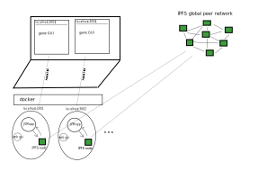

Continuation of:

- [../cloud-native-system/design.md](../cloud-native-system/design.md)
- [../search-for-the-game.md](../search-for-the-game.md)
- [../origin-cluster/origin-cluster.md](../origin-cluster/origin-cluster.md)
- [../deathstar.ltee/as-vscode-extension.md](../deathstar.ltee/as-vscode-extension.md)
- [../deathstar.ltee/design-notes.md](../deathstar.ltee/design-notes.md)

## app design

</img>

- extensions self "register" - perform needed ops using `deathstar.ext.main.chan` api, main has app's db(state) and exposes ops
  - e.g. `(ext.main.chan/add-tab ops{name 'resolvable-symbol-to-renderer ..})` - assoc symbol into db atom and we see gui updated with for example new tab
  `(ext.main.chan/another-state-changing-op..)`
- keep state as data: only serializable (use symbols if needed)
- `src/ext` dir structure
  - `main-meta` - has channel api, spec, protocols ..
  - `main-impl` - implementation
  - `router-meta`
  - `router-impl`
  - `scenario-list-meta`
  - `scenario-list-impl`
  ...
- app is siply a main.cljs file that creates channels, creates state(s), imports extensions and starts them like `(ext.foo/proc-ops channels state)`
- `scenario-list`, for exmaple, when it starts, adds item to the list of tabs (navigation) and respective tab content (via  `(main.chan/add-this)` `(main.chan/add-that)`
- extension explorer(panel) is a list, on click coresponding symbol (like `ext.foo.renderer/rc-main`) is resolved and used for rendering
- channels are formed as usual - by merging `(ext.foo/create-channels)`
- as usual, all kewords are namespaced, no collisions/ambiguity
- extensions are smart : they tap/pipe into needed channels
- GUI-wise: VSCode best practices, e.g. use collapsible sidebar (left) for extensions
- state 
  - extensions on entry create their default state and merge it into ext.main state (it's an atom they get as arg)
  - app's state is a flat map of fully qualified keywords (ext.foo/some-val ext.bar/pred? ..)
  - esentially, extensions are free to change state, as if they write to db via connection
- extensions have `pipes` method
  - a function that does piping so that proc-ops stays clean
  - proc-ops calls `pipes` itself
- scenarios
  - also expose `create-proc-ops` and api in `sceanrio.chan` (`create-simulation`, `start` ... and other api for game to use)
  - have state for gui and game space(simulation), we render those
  - scenarios know how to determine the winner and notify the game (or the game uses some `check-if-game-complete` api fn
- 0, 1 or more players hub process with an api
  - design in such way that player "connects/joins" the "hub", so that it's possible to add players (hotseat, AI(bots) or some other way)
  - it should be abstracted in a way that we join the "multiplayer", when 1 player it becomes single player
  - hub is an extension (just writes state to db atom) and exposes api that "virtual" user uses (us, or hotseat or bot or libp2p..)
  - hotseat: nope, not needed, boring and obsolete - if multiple people are at a single pc, they can enjoy completeing scenarios together and possibly playing vs AI
  - so design is always for simultaneous simulations (0,1 or more) players
- conquest and 1 player: continue playing option
  - simple: if scenario implies conquest victory and we start single player, we see "vicotry" and option "continue playing" - so we play on
- identity
  - on opening browser page, user enters their name
  - that name plus some id (random uuid or maybe smth from libp2p) - is a unique id for games
  - data is ephimeral, play-scenarios-in-browser by design does not store data, so name+id is sufficient
- no HTTP (*sigh of joy*): first it's a legacy protocol, won't be used in DeathStarGame overall, second - play-scenarios-in-browser is single-player and *maybe* will use p2p
- versions
  - name like v20201025, keep previous deployments so possible to open DeathStarGame.github.io/play-scenarios-in-browser/v20201025
- evaluating user's code: namespaces
  - use self-hosted cljs obviously
  - for a new game a namespace is genereated for the user, which is what we see in the editor and where we can eval expressions
  - once the game needs the code, we eval that whole namespace and use its "exports" (vars that scenario expects) within the simulation
  - namespace can be for example suffixed with user's unique id or part of it, e.g. `scenario.foo.player-code-2834j9jfs`
  - hub(multiplayer) extension contains this logic
- single player
  - the scenarios should be playable in single palyer mode as-is, with that tab being a single "connection" to hub extension
- multiplayer: libp2p, webRTC and IPFS
  - WebRTC is usable with a signal server, which is a centrazlied and fragile concept
  - libp2p examples use legacy/temporary `-star` protocols, which rely on a few dev servers run by libp2p itself
  - so in both cases, it's the same thing - signal servers
  - instead, design for tab to interact with IPFS node  - directly or via companion browser extension
  - so instead of some signal servers, we use the whole IPFS network to find and connect to peers
  - what it should look like: discover host peer via IPFS network, connect many-to-one
    - we open multiple browser tabs, each representing a player
    - GUI shows us our peer id
    - we can send that peer id manually to others (email,chat) and they should be able to connect to our browser tab
    - now it's possible to exchange messages bidirectionally, with players being connected to our tab (many-to-one)

#### realizing: it should be an app around IPFS node

- IPFS node is identity and networking
  - given the design above, we communicate as peers via IPFS
  - and that gives us IDENTITY - as peers have unique CID (or name)
  - we can connect to the host peer right through existing global network with a real ID of our peer node
  - and we can play by biderectionally exhanging messages between host peer and connectees
- hosting hub in browser means no multithreading besides webworkers
  - means talking via messages
  - webwrokers cannot talk to each other
  - it's fragile long term, but since we've realized it's IPFS node, we can talk to it from app as well
- it should be a docker deployment or a way to turn it into installable binary with web gui

</img>

- it's possible to launch several containers/deployments on one machine for multiplayer development
- user does not need to install IPFS - as the instance comes with IPFS node
- essentailly, it is already deathstar final edition, not even ltee
- questions: how to distirbute, *how to update*
